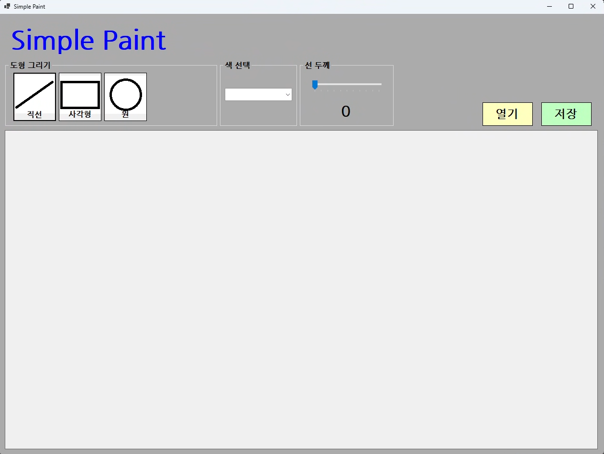
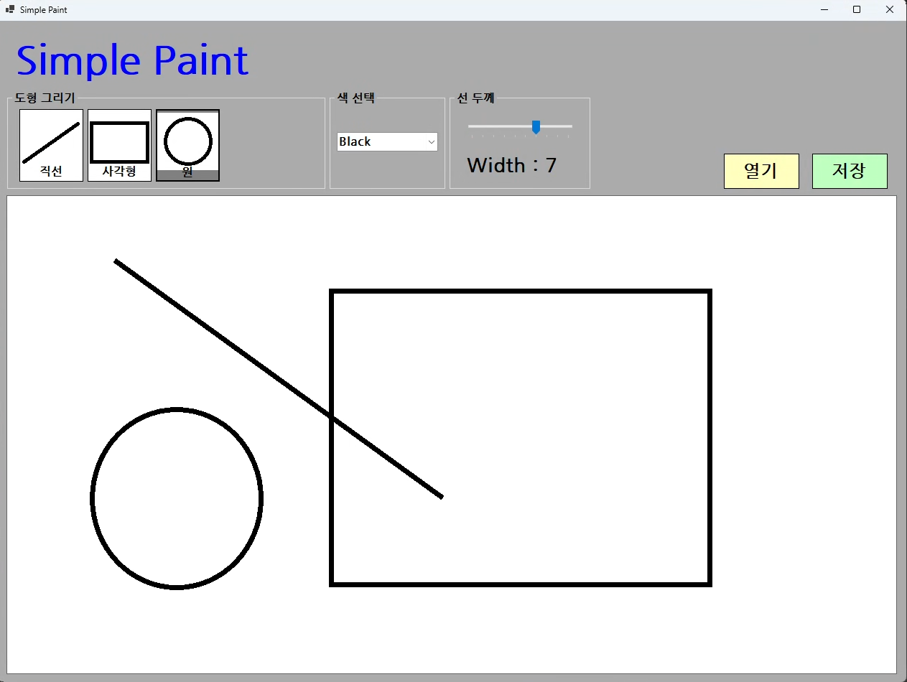
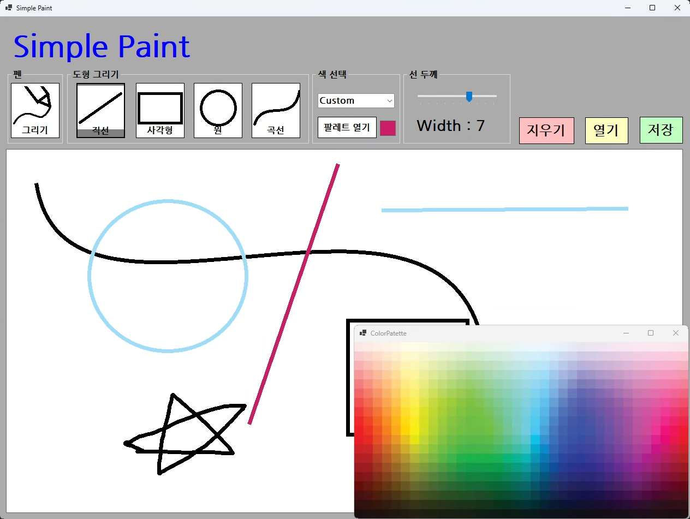
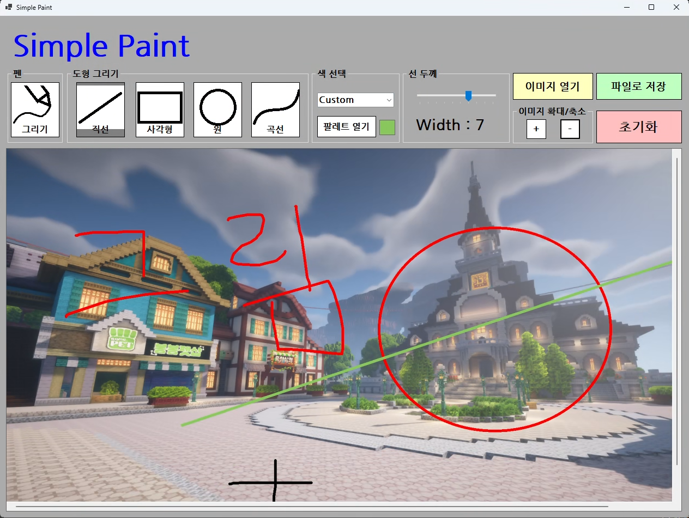

# (C# 코딩) 그림판 프로그램

## 개요
- C# 프로그래밍 학습
- 1줄 소개: 마우스를 이용한 도형 및 자유 곡선 그리기, 외부 이미지 불러오기, 확대/축소 및 이미지 저장 기능을 제공하는 그림판 프로그램
- 사용한 플랫폼:
    - C#, .NET 10 Windows Forms, Visual Studio, GitHub
- 사용한 컨트롤: 
    - PictureBox, Button, ComboBox, TrackBar, GroupBox, Panel, SaveFileDialog, OpenFileDialog
- 사용한 기술과 구현한 기능:
    - 마우스 이벤트를 활용한 직선, 사각형, 원, 곡선, 펜 그리기
    - 색상 선택(별도 팔레트 폼 스포이드 연동) 및 선 굵기 조절
    - 그려진 그림을 png, jpg, bmp 이미지 파일로 저장
    - 외부 이미지 불러오기 및 캔버스로 활용
    - Panel 컨트롤을 이용한 이미지 스크롤바 지원
    - Ctrl + 마우스 휠 및 버튼을 통한 캔버스 확대/축소 기능

# 각 과제별 실행 화면

## 실행 화면 (과제1)

 

- 과제 내용
    - 컨트롤 배치와 기본적인 속성 설정
    - 컨트롤 이름 정하기
    - 도형 선택, 색상 선택, 선 굵기 선택 기능 구현

- 구현 내용과 기능 설명
    - 그룹 박스를 이용해 도형, 색상, 선 두께 제어 UI 레이아웃 구성
    - 코드를 통해 선택된 도형 버튼의 색상을 변경하여 현재 모드 시각화
    - TrackBar를 이용한 선 굵기 동적 조절 및 ComboBox를 통한 기본 색상 선택 

## 실행 화면 (과제2)

 

- 과제 내용
    - 마우스 드래그를 이용한 그림 그리기 기능 구현
    - 직선, 사각형, 원 그리기 기능 구현

- 구현 내용과 기능 설명
    - PictureBox의 MouseDown, MouseMove, MouseUp 이벤트를 활용해 그리기 로직 처리
    - Paint 이벤트와 반투명 펜을 결합하여 드래그 중 도형의 위치와 크기 실시간 미리보기 제공
    - 직선, 사각형, 원뿐만 아니라 자유 곡선(Pen), 베지어 곡선(Curve) 알고리즘도 추가 구현

## 실행 화면 (과제3)

 

- 과제 내용
    - 그려진 그림을 이미지 파일로 저장하는 기능 구현
    - 파일 저장을 위한 대화상자인 SaveFileDialog 사용
    - 3가지 포맷으로 저장 (png, jpg, bmp)

- 구현 내용과 기능 설명
    - SaveFileDialog를 통해 저장 경로 및 파일명을 지정하는 UI 호출
    - 사용자가 선택한 필터 인덱스를 파악하여 System.Drawing.Imaging.ImageFormat를 결정
    - 캔버스 비트맵 객체의 Save 메서드를 사용해 지정된 형식으로 안전하게 파일 출력

## 실행 화면 (과제4)

 

- 과제 내용
    - 외부 이미지 파일을 읽어들여서 그걸 캔버스로 삼아 그 위에 그림을 그리고, 완성된 그림을 파일로 저장하는 기능 구현
    - 외부에서 이미지 파일을 읽어들여서 캔버스로 사용
    - 이미지 크기에 맞춰 캔버스 크기 조정
    - 이미지 크기가 큰 경우 스크롤바 만들기
    - 확대/축소 기능 넣기

- 구현 내용과 기능 설명
    - OpenFileDialog로 외부 이미지 파일을 Bitmap으로 읽어들여 캔버스에 적용
    - Panel의 AutoScroll 기능을 활성화하여 캔버스가 패널보다 커질 때 자동으로 스크롤바가 생성되도록 처리
    - Ctrl + 마우스 휠 이벤트와 버튼을 이용해 zoomFactor 비율을 조절하고 ScaleTransform 적용으로 부드러운 이미지 확대/축소 지원